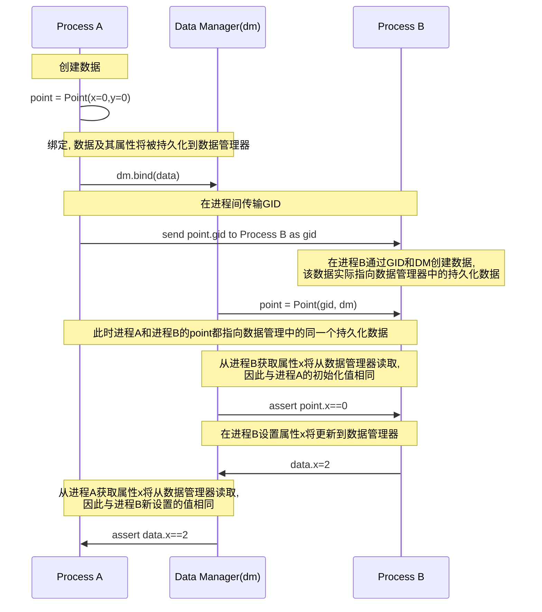

# ZJB-Framework
一个面向数据的数据及作业管理框架, 无需数据库代码即可实现数据持久化

### 像使用内存中的数据一样使用数据库中的数据

本框架的最基本的目标是简化数据的持久化操作,通过将对数据属性的赋值与更新数据库操作绑定,将获取数据属性与读取数据库操作绑定,使数据库中的持久化数据表现的像在内存中一样

以下序列图描述了数据是如何持久化并在不同进程间同步的.



在任何进程中, 不需要额外调用数据库接口(被封装到`DataManager`和`Data`类), 就可以像操作内存中的数据一样赋值或读取持久化(绑定)到数据管理器的数据, 从而实现了数据在不同进程之间的同步.

### 通过创建类来描述数据, 不需要手动创建数据表

本框架的另一个优点在于, 不需要手动创建任何数据表, 在代码中继承`Data`类即可使用数据管理器持久化数据.

在SQL数据库中, 通常要为每种数据创建一个数据表, 还需要精心考虑如何设计字段来存储不同的数据. 对于文档型和键值对型等NoSQL数据库, 虽然其更加灵活而简化了该问题, 但仍然需要在读写数据时考虑数据库/表的结构. 因此很多编程场景会被称为面向数据库编程.

本框架将数据统一转换为(属性名,属性值)的键值对形式统一存储到数据库中, 数据的结构与关系都可以通过其属性描述.

例如:

```python
from traits.api import Float, Instance
class Point(Data):
    x = Float()
    y = Float()
class Line(Data):
    start = Instance(Point)
    end = Instance(Point)
```

这个例子中, `Point`类具有`x`和`y`两个浮点数属性描述其坐标, `Line`类的两个属性`start`和`end`则是`Point`实例描述其起点坐标与终点坐标.

对于这样两个结构不同且具有关联的类, 直接引用本框架持久化, 能够完全保留数据的结构与关系.